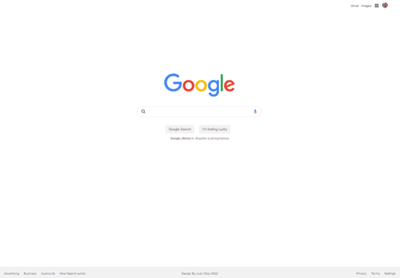

# Google Clone 

Project developed on the Platzi course [Curso Práctico de HTML y CSS](https://platzi.com/cursos/html-practico/)

<!-- Project is Deployed on Vercel: [URL](google-clone-phi-three.vercel.app) -->

Project Deployed on Github: [https://juanpablodiaz.github.io/googleClone/](https://juanpablodiaz.github.io/googleClone/)

## NEXT CHALLENGE: i NEED TO MAKE IT RESPONSIVE!!